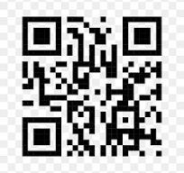

# 1- Headings
How to give headings in markdown files?

# Heading 1
## Heading 2
### Heading 3
#### Heading 4

# 2- Block of words
This is a normal text in Markdown.

> This is a block of special text.
> 
> This is another block of special text.

# 3- Line breaks

This is a 40 days long course of Data Science.\
This is another line.

# 4- Combine two things

Block of words and heading
> ## Heading 2

# 5- Face of text

**Bold**

*Italic*

or you can use these symbols
_ (underscore)

__Bold__

_Italic_

# 6- Bullet points / Lists

- Day-1
- Day-2
- Day-3
- Day-4
- Day-5
  - Day-5a
    - sub list (anything)
  - Day-5b
- Day-6
- Day-7
- Day-8

> you can also use * or + for bullet points

* Day1
* Day2
+ DAY3
+ Day4
  

> Numbering of lists

1. Day1
2. Day2
3. Day3
1. Day4
1. Day5
   1. Day5a
   2. Day5b
2. Day6
3. Day7

# 7- Line breaks or page breaks

This is page 1.

---
***
___

This is page 2.

# 8- Links and HyperLinks

<https://github.com/Zain-Ul-Abaiden>

[github](https://github.com/Zain-Ul-Abaiden)

we are making key. when we use it then they always give us link

[github]:https://github.com/Zain-Ul-Abaiden

Hey my name is Zain. Click [here][github] to go through my github profile. 

# 9- Images and Figures with link

To join telegram channel please scan the QR code below:




> # comment in markdown

[This is a comment that will be hidden.]: #

Online Pictures


# 10- Adding code or block code

To print a string in python we use `print()` function.

`print("Hello World!)`

> after ``` use name of language according to thier context


```python
x = 2;
y = 3;
z = x + y;
print(z) # prints 5
````

# 11- Adding tables

| species | petal_length | sepal_length |
|:--------:|:-------------:|:------------:|
| Iris-setosa | 5.1          | 3.5          |
| virginica | 4.9          | 3.0          |
| verisicolor | 4.7          | 3.2          |

# 12- content

[1. Headings](#1--headings)\
[2. Block of words](#2--block-of-words)\
[3. Line Breaks](#3--line-breaks)\
[4. Combine two things](#4--combine-two-things)\
[5. Face of text](#5--face-of-text)\
[6. Bullet points lists](#6--bullet-points--lists)\
[7. Line breaks or page breaks](#7--line-breaks-or-page-breaks)\
[8. links and hyperlinks](#8--links-and-hyperlinks)\
[9. Images and figures with link](#9--images-and-figures-with-link)\
[10. Adding code or block code](#10--adding-code-or-block-code)\
[11. Adding tables](#11--adding-tables)\

# 13- Install extensions

**Simple Text**

_Italic_

[Link](https://www.google.com/imgres?q=nature&imgurl=https%3A%2F%2Fnatureconservancy-h.assetsadobe.com%2Fis%2Fimage%2Fcontent%2Fdam%2Ftnc%2Fnature%2Fen%2Fphotos%2FZugpsitze_mountain.jpg%3Fcrop%3D0%252C214%252C3008%252C1579%26wid%3D1200%26hei%3D630%26scl%3D2.506666666666667&imgrefurl=https%3A%2F%2Fwww.nature.org%2Fen-us%2Fabout-us%2Fwhere-we-work%2Feurope%2F&docid=Wdc2RwTDh0HtEM&tbnid=-fCHnceBVG7sgM&vet=12ahUKEwji6Jrdt_WJAxUyT6QEHQy8CzEQM3oECGYQAA..i&w=1200&h=630&hcb=2&ved=2ahUKEwji6Jrdt_WJAxUyT6QEHQy8CzEQM3oECGYQAA)
